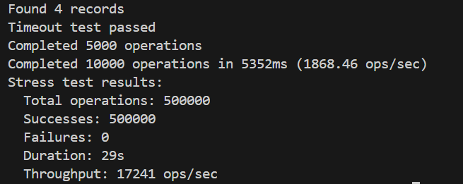

# C++ PostgreSQL Connection Pool Library


*Performance On windows subsystem for linux core i5 1155G7 @ 2.5 Ghz, 8GB ram*


A high-performance, thread-safe connection pool implementation for PostgreSQL using C++17 and pqxx.

## Features

- **Connection Pooling** - Manage multiple database connections efficiently
- **Thread Safety** - Safe for concurrent access across multiple threads
- **Prepared Statements** - Support for pre-defined SQL statements
- **Timeout Handling** - Configurable wait time for connection acquisition
- **Dynamic Resizing** - Adjust pool size at runtime
- **Connection Validation** - Automatic handling of failed connections
- **Singleton Management** - Global pool management through ConnectionPoolManager
- **Retry Mechanism** - Automatic retries for initial connection establishment

## Dependencies

- C++17 compiler
- libpqxx 7.7+
- PostgreSQL 12+ client libraries
- CMake 3.15+ (for building)

## Installation

1. Install dependencies:
```bash
sudo apt-get install libpqxx-dev postgresql-server-dev-12
```

2. Include in your project:
```cmake
find_package(libpqxx REQUIRED)
target_link_libraries(your_target PRIVATE libpqxx)
```

## Usage
```cpp
#include "ConnectionPoolManager.hpp"

int main() {
    const char* conn_str = "dbname=test user=postgres host=localhost port=5432 password=GenshinImpactIsForG*ys";
    std::vector<Statement> stmts = {
        {"get_user", "SELECT * FROM users WHERE id = $1"}
    };

    // Register connection pool
    ConnectionPoolManager::instance().registerPool(
        conn_str, "user_db", 5, 2s, stmts
    );

    // Use connection
    auto& pool = ConnectionPoolManager::instance().get_pool("user_db");
    {
        auto conn = pool.get_connection();
        pqxx::work txn(*conn);
        auto result = txn.exec_prepared("get_user", 123);
        txn.commit();
    }

    ConnectionPoolManager::instance().shutdown();
    return 0;
}
```

## API Reference
### ConnectionPool Class
#### Methods

- ```get_connection():``` Returns a ConnectionGuard with an active connection

- ```drain():``` Close all connections in the pool

- ```increase_connection():``` Attempt to add a new connection to the pool

- ```decrease_connection():``` Remove a connection from the pool (waits up to 10s)

- ```get_current_connections():``` Returns current number of managed connections

### ConnectionGuard
- RAII wrapper that automatically returns connections to the pool
- Provides pointer access to underlying pqxx::connection

### ConnectionPoolManager Class
#### Methods

- ```registerPool():``` Register a new connection pool
- ```get_pool():``` Retrieve a registered pool by name
- ```shutdown():``` Drain and remove all connection pools

### Exceptions

The library throws the following exceptions:

- ```pqxx::broken_connection:``` Connection initialization failures
- ```std::runtime_error:``` Timeout on connection acquisition
- ```std::out_of_range:``` Access to non-existent pool


